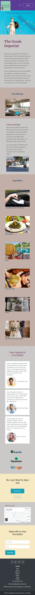

# The Greek Imperial Hotel with Bootstrap

This website was developed for a fictional hotel located in Tarpon Springs, FL. It showcases the hotel with a brief overview and history, the amenities, accomodations, reviews and social proof sections, a map to indicate the location and attractions nearby.
\
&nbsp;

## Technologies:

\
&nbsp;
\
&nbsp;
\
&nbsp;
\
&nbsp;
\
&nbsp;
\
&nbsp;\
&nbsp;

## Wireframe / Design Process:

Click on the following links to view the wireframes:

[Wireframe for the XS viewport](https://wireframe.cc/a4yJfp)

[Wireframe for the Large viewport](https://wireframe.cc/TMwA3K)
\
&nbsp;

## Screenshots:

### Large Viewport:

\
&nbsp;

\
\
&nbsp;

### XS Viewport:

&nbsp;

## Features:

Anytime the "Book" Button is clicked a modal will appear on the screen with the room options (options can be chosen but the "Check availability button" in the modal will redirect to the main page at the moment). For more functionality, you can check out [the Greek Imperial Hotel with React](https://thegreekimperialhoteltarponsprings.netlify.app/)!

## Want to see the Bootstrap version live? Visit the [Greek Imperial Hotel](https://thegreekimperialhotel.netlify.app/) website 🧳
